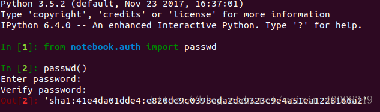

## 如何开启jupyter?
* 安装jupyter
```
# 先升级一下ipython
$ pip install ipython --upgrade

# 安装jupyter
$ pip install jupyter notebook
```

### 配置远程访问jupyter
1. 正向代理:
注意将以下端口替换为自己的端口
* 在你自己的电脑上执行``ssh -NL 30615:10.10.10.111:30615 admin`` 这里是拿Node11举例,nodexx其ip就是10.10.10.1xx. 在浏览器中输入localhost:30615即可访问。
* 如果在admin执行,``ssh -NL 10.15.89.41:30615:0.0.0.0:30615 node11`` 10.15.89.41即为admin节点在校园网中的ip。在浏览器中输入10.15.89.41:30615即可访问

2. 反向代理:
* 生成密码
```
$ ipython
```
* 在python命令行里分别输入：
```
$ from notebook.auth import passwd
$ passwd()
```
* 输完之后，设定一个密码，会生成一个sha1的秘钥会有如下的结果：

* 记录生成的sha1秘钥，然后退出
```
quit()
```
* 生成jupyter notebook的配置文件
```
$ jupyter notebook --generate-config
$ vim ~/.jupyter/jupyter_notebook_config.py

##  加入如下内容
c.NotebookApp.ip='*'
c.NotebookApp.password = u'sha1:41e4da01dde4:e820dc9c0398eda2dc9323c9e4a51ea1228166a2' ## 将生成的sha1密钥填写在这里。
c.NotebookApp.open_browser = False
```
* 进入计算节点(node xx)，开启反向代理:

由于我们无法在本地直接访问计算节点(node xx)，所以我们需要先进入计算节点添加反向代理。

```
$ ssh nodexx # 进入计算节点
# 注意端口需要用到分配的ADMIN_PORT 3xxxx - 3xxxx中的其中一个, 下面以30339为例
$ ssh -CNfR 30339:0.0.0.0:30339 admin
```

* 在开启反向代理的那个节点(node xx)开启jupyter:
```
$ jupyter notebook --allow-root --ip=0.0.0.0 --port=30339
```

* 最后我们可以在浏览器中通过访问  **10.15.89.41:30339**, 进入jupyter

## 如何开启visdom?
*  安装visdom
```
$ pip install visdom
```
* 启动visdom
  
Visdom需要和PyTorch程序运行在同一计算节点上，否则PyTorch程序将不能检测到正在运行的visdom。第一次打开visdom会比较慢，因为visdom需要自己下载一些脚本。

1.在服务器上运行visdom并指定端口。请前往集群主页的`User Permission`页面查询分配给自己的端口，下面以30330为例。
```
$ python -m visdom.server -p 30330
```

2.在Python程序中创建Visdom实例，并指定参数。
```python
import visdom
vis = visdom.Visdom(server='10.15.89.41', port=30330, use_incoming_socket=False)
```

* 详细教程，请移步[visdom github](https://github.com/facebookresearch/visdom)主页。
